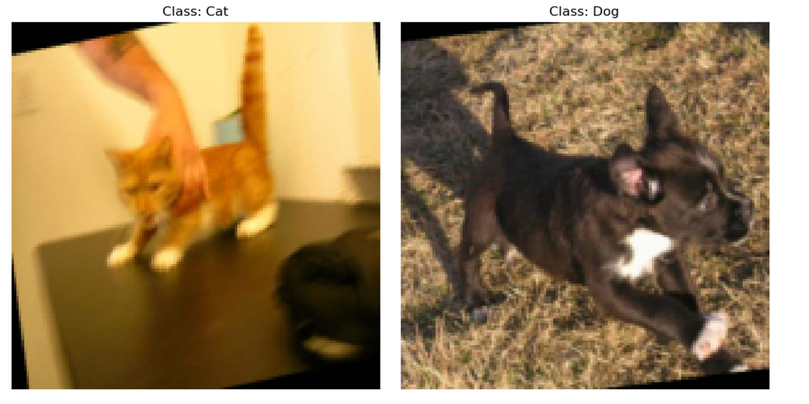
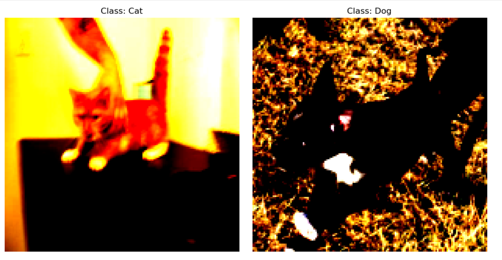

下载[Kaggle 猫狗数据集](https://www.microsoft.com/en-us/download/details.aspx?id=54765)到本地，然后运行·=`dataset_process`代码划分数据集。
*原始数据中存在无法读取的图片(`Cat/666.png`、`Dog/11702.png`), 直接删除或替换即可。*

### 训练迭代过程(部分)

*之所以是部分，是因为作者在这个项目快做完的时候才想到要记录一下过程...  于是就设计了几个不同的配置加以对照*

- 1. lr=1e-3, num_epochs = 20 : Train_acc:90.5%, Train_loss:0.228, Test_acc:86.7%，Test_loss:0.322 明显出现了过拟合
- 2. lr=1e-4, num_epochs = 20 : Train_acc:81.4%, Train_loss:0.409, Test_acc:83.4%，Test_loss:0.383 学习率太小，训练不充分, 导致欠拟合
- 3. lr=1e-3, 使用StepLR学习率衰减策略，权重衰减: Train_acc:90.3%, Train_loss:0.239, Test_acc:88.0%，Test_loss:0.304 相比于1, 学习率衰减和权重衰减确实能减轻过拟合, 但是过拟合仍然存在
- 4. lr=1e-3, num_epochs = 20, 增加水平翻转、旋转、颜色抖动的数据增强操作：Train_acc:87.9%, Train_loss:0.291, Test_acc:87.6%，Test_loss:0.288 完美解决了过拟合的问题！果然数据集才是根本。不过准确率还是差了一些 
- 5. lr=1e-3, num_epochs = 20, 新增加一个卷积层`conv4`：Train_acc:94.9%, Train_loss:0.124, Test_acc:91.9%，Test_loss:0.199 只增加了一个卷积层就大幅提升了模型性能！！！看来模型架构是关键。存在过拟合
- 6. lr=1e-3, num_epochs = 20, 数据增强，使用StepLR学习率衰减策略，权重衰减，新增加一个卷积层`conv4`： Train_acc:93.6%, Train_loss:0.166, Test_acc:92.5%，Test_loss:0.185 终极模型，可惜效果比预想的要差一些


---

### 数据标准化对模型的影响

一开始参考别人的教程, 我对数据使用了标准化操作
```python
transforms.Normalize(              # 对张量进行标准化处理, 提升模型训练的稳定性
        mean=[0.485, 0.456, 0.406],    # 使用 ImageNet 数据集的均值
        std=[0.229, 0.224, 0.225]      # 使用 ImageNet 数据集的标准差
    )
```
但是当我把处理后的图片输出后大为震惊, 发现图片被处理得严重失真, 连肉眼都很难分辨。

标准化前：
    

标准化后：


我觉得这肯定会损害模型的性能, 于是就请教了GPT老师, 它告诉我:

---

### **为什么标准化会导致图片“失真”？**
`transforms.Normalize` 是针对模型的输入进行标准化处理的操作，它使用给定的均值和标准差将像素值归一化为零均值和单位标准差。标准化后的像素值可能包含负值，因此直接展示这些数据时，肉眼会看到“失真”效果，但实际上这对模型的训练有利。

- **标准化的目的**：
  - 减少特征值范围差异，帮助模型更快地收敛。
  - 提高模型对数据分布的鲁棒性，特别是在使用预训练模型（如 ResNet）时，保持输入数据与预训练的分布一致。

- **为什么图像会失真**：
  标准化是针对张量进行数学操作，最终会改变图像像素的视觉表现，但它不会影响模型接收的特征信息。

### **是否可以直接移除标准化？**
**结论：**
- 如果使用预训练模型：不建议移除标准化，推荐调整或逆向还原以适应展示需求。
- 如果从头训练模型：可以移除，但可能需要更长的训练时间来弥补标准化带来的优势。

---
看到这里我心里放心了不少, 但是还需要用实验来验证它的说法


未标准化(lr=1e-3, num_epochs = 5)：Train_acc:82.8%, Train_loss:0.383, Test_acc:82.0%，Test_loss:0.387

标准化：Epoch: 5, Train_acc:83.0%, Train_loss:0.383, Test_acc:82.7%，Test_loss:0.385 

说明确实会有用？ 具体影响还有待深入探究。

不过至少不会像我最开始想的那样损害模型性能，在上面的迭代过程中均默认使用了(ImageNet)标准化操作。

**猜想: 将将均值和标准差调整为基于当前数据集的统计值效果应该能达到更好的效果, 有待进一步验证**