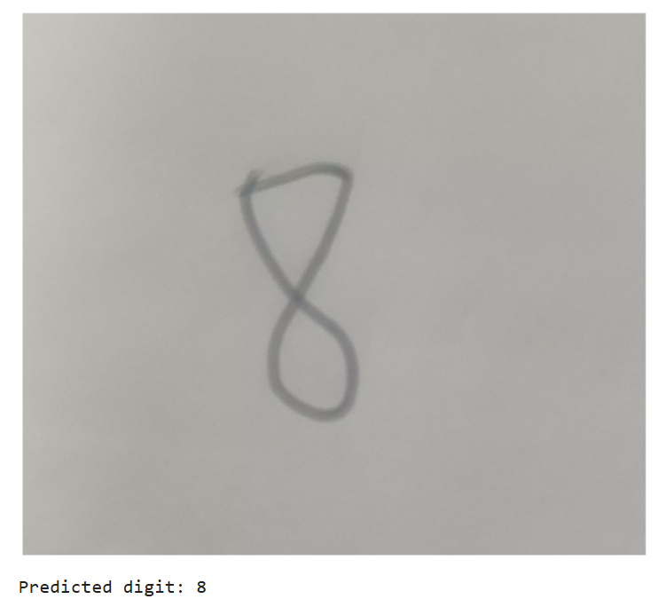
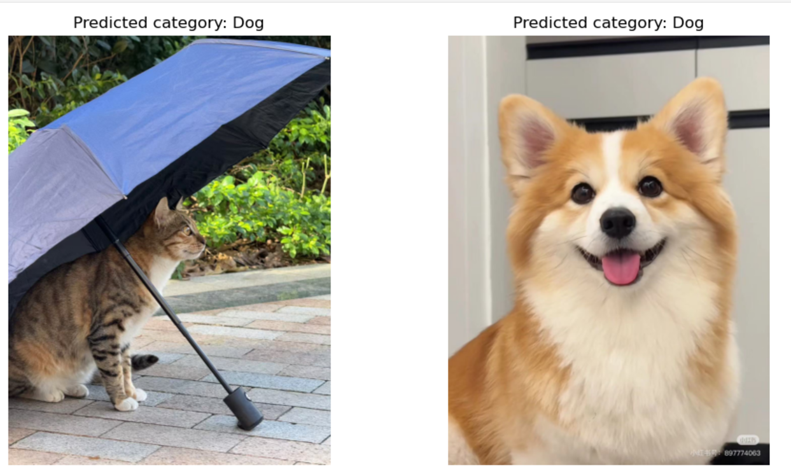
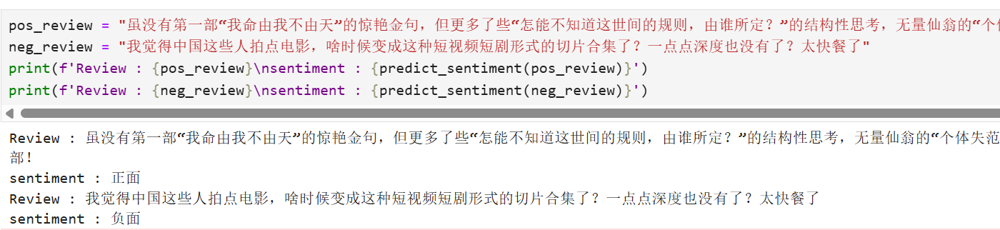
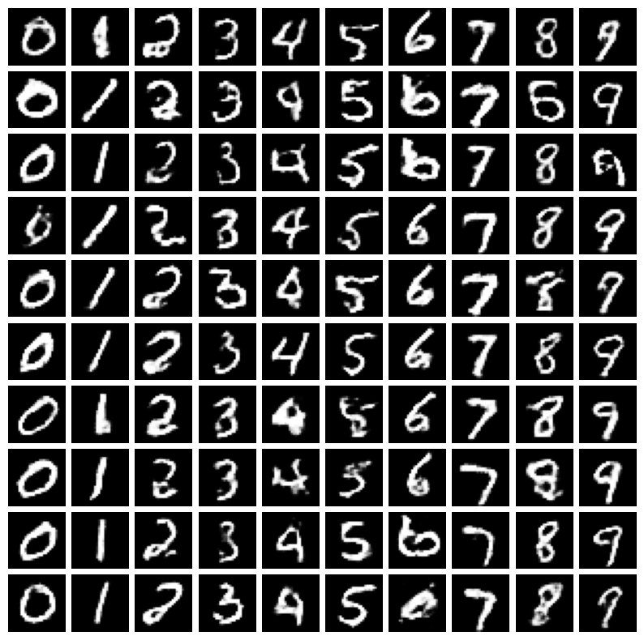
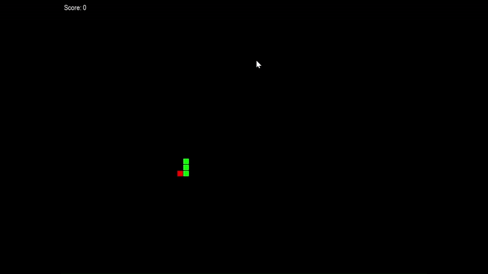
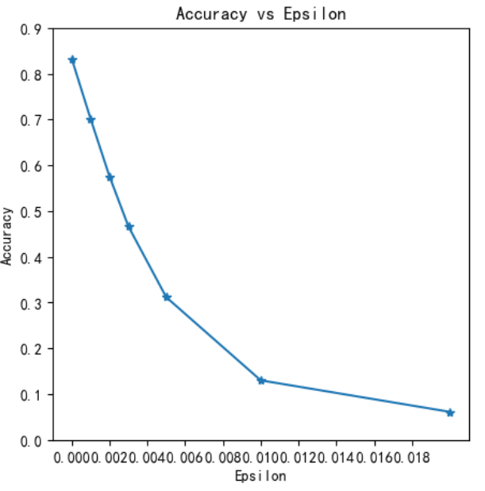
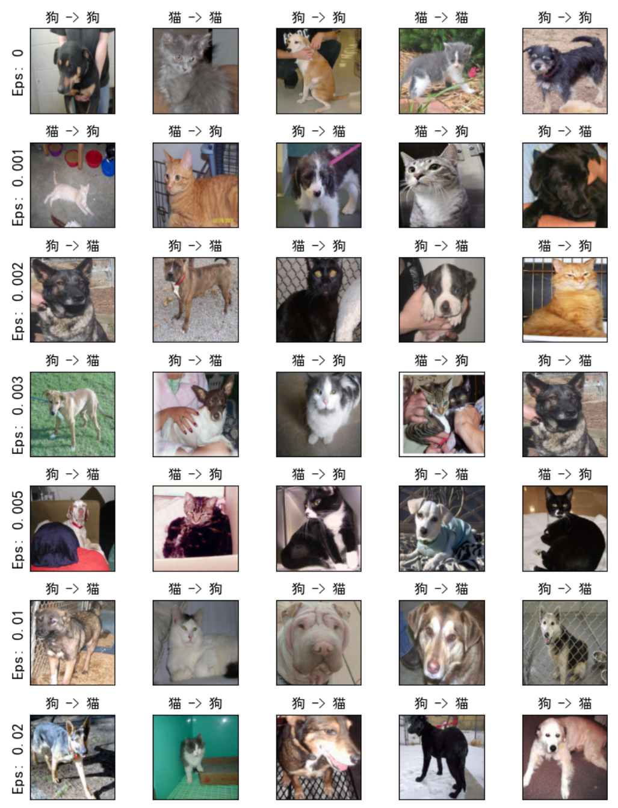
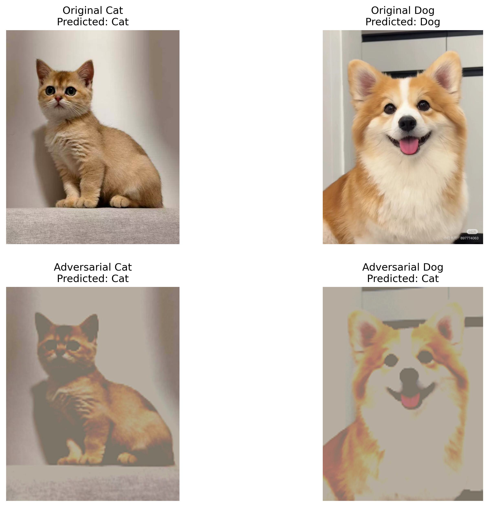

# 🚀 PyTorch 深度学习实战教程 🚀

欢迎来到 **PyTorch 深度学习实战教程**！🎉  

本项目汇集了多个基于 PyTorch 的深度学习实战项目，注释详尽、结构清晰，非常适合作为学习和练习 PyTorch 的参考项目。

**不断完善ing...**

## 🎯更新日志
- 2024-11-23: 新增项目1: 手写体数字识别
- 2024-12-02: 新增项目2: 猫狗图像分类
- 2025-01-01: 新增项目3: 中文影评文本分类
- 2025-02-28: 新增项目4: GAN 图像生成
- 2025-03-19: 新增项目5: RL 贪吃蛇
- 2025-04-02: 新增项目6: 对抗样本攻击(待优化)

---

## 目录 📚

1. [手写体数字识别 (Handwritten Digit Recognition)](#1-手写体数字识别-handwritten-digit-recognition)  
2. [猫狗图像分类 (Cat & Dog Image Classification)](#2-猫狗图像分类-cat--dog-image-classification)
3. [Transformer-情感分类 (Transformer-based Sentiment Classification)](#3-transformer-情感分类-transformer-based-sentiment-classification)
4. [GAN-图像生成 (GAN Image Generation)](#4-GAN-图像生成-GAN-image-generation)
5. [RL-贪吃蛇 (Reinforcement Learning Snake)](#5-RL-贪吃蛇-reinforcement-learning-snake)
6. [对抗样本攻击 (Adversarial Attack)](#6-对抗样本攻击-adversarial-attack)

---

## 🧐 项目介绍

- 包含多个经典 PyTorch 项目：手写体数字识别、猫狗分类等。
- 每个项目配备完整的代码流程，包括数据处理、模型训练、结果可视化、模型保存及推理调用等。
- 每个项目在训练好模型之后都会有使用模型进行推理的部分，可以直接把代码拿到别的地方使用，实用性很强。
- 项目中的一些细节优化均有详细的注释, 但是并不保证绝对准确有效。你可以加以分析参考, 并提出自己的见解, 有什么想法欢迎提出issues进行交流。
- **项目会持续更新和优化，欢迎关注！**

如果觉得这个项目有帮助, 别忘了点个star支持一下! 🌟, 并留下宝贵的意见。 
如果有任何问题，欢迎提 Issues, 作者在看到后会及时回复。💬

### 项目结构 📂

PyTorch
- datasets 数据集
- models 模型权重
- 1_Handwritten_Digit_Recognition
- 2_Cat_Dog_Image_Classification
- 3_Chinese_Movie_Review_Text_Classification
- readme.md

⚠️ **提示**
- 有些模型效果可能不太好。 你可以自行探索，修改模型结构和一些参数以达到更好的效果，还可以在项目代码基础上扩展更丰富的功能。  
- 为了达到更好的训练效果, 作者在编写代码训练模型时在不断尝试不同的方法, 但是这个过程在代码中可能并没有体现。 希望大家能够自己多修改一些参数, 使用不同的模型结构和方法, 去感受模型训练的过程

---

## 环境要求 ⚙️

- Python 3.x
- PyTorch 深度学习框架
- Jupyter Notebook 用于交互式编程
- 其他依赖库

---

## 1. 手写体数字识别 (Handwritten Digit Recognition)

🖊️🔢

### 🎯 项目概述
本项目基于经典的 MNIST 数据集，训练一个简单的卷积神经网络, 逐步实现从单个数字到多个数字的手写体识别。

### 项目展示

    
多数字识别  
  

### 💡 一些想法

- 分割的算法很关键，会直接影响到模型预测结果。如果有一个好的分割算法，用一个识别单个字符的模型就可以实现识别一组字符的功能。
- 现在已经能够识别多个数字，如果自己能够找一些手写运算符号的数据集（+ - × ÷...）一起训练模型，就能让模型识别基本的算术表达式。自己再写函数对表达式进行处理计算结果，就得到了数学计算题目-->运算结果的高级模型😁！
- 如果能够找到字母数据集进行训练, 就可以得到一个简单的OCR模型(汉字数据集太大了，就不考虑了哈哈)
- 这个项目可以不断进行优化迭代, 希望大家能多多尝试！ 

### 进阶
[K-12 手写体（HME100K）数据集](https://ai.100tal.com/dataset)  
利用这里的数据集实现 图片-->对应的markdown公式

---

## 2. 猫狗图像分类 (Cat & Dog Image Classification) 

🐱🐶

### 🎯 项目概述

本项目基于 [Kaggle 猫狗数据集](https://www.microsoft.com/en-us/download/details.aspx?id=54765) ，使用 PyTorch 构建并训练一个卷积神经网络，用于分类猫和狗的图像。

### 项目展示

### 项目亮点 ✨
- 相比于手写体数字识别的项目, 本项目构建了相对复杂的CNN模型
- 项目readme中记录了不同的训练设置所对应的训练结果, 并且探讨了数据集标准化对训练结果的影响

### 待探究的问题 🔬
- 当增加数据增强操作后, 明明数据集大小和数量都没变, 但是不知道为什么训练速度很明显变慢了(一个epoch平均不到5min->10min)。&cross;
- 使用基于当前数据集的统计值的数据进行标准化操作能不能达到更好的效果？ &cross;

---

## 3. Transformer-情感分类 (Transformer-based Sentiment Classification) 

🎬🗣

### 🎯 项目概述

本项目基于从豆瓣爬取的中文影评数据集，使用 PyTorch 实现了一个 Transformer 模型进行二分类任务（正面/负面情感）。  
项目使用 bert-base-chinese 分词器对中文文本进行预处理，并通过 Transformer 架构捕捉评论的语义信息，旨在实现高效、准确的情感分类。  

### 项目展示

### 项目亮点 ✨
- **大规模自建数据集**：数据集由作者自己构建，包含 50 万+ 条高质量中文影评，数据丰富，质量较高
- **自定义 Transformer 模型**：从头设计的 TransformerClassifier，包含可学习位置编码、多层 Transformer Encoder 和分类头，灵活适配中文情感分析  

### 待探究的问题 🔬
- **数据处理：** 本项目中对影评数据处理比较粗糙，可以探究多种中文文本数据预处理方法
- **语义分析：** 提取 Transformer 注意力权重，分析哪些词对情感分类贡献最大，生成情感关键词云

---

## 4. GAN-图像生成 (GAN Image Generation)

🎨🖼️

### 🎯 项目概述

本项目基于 MNIST 数据集, 使用生成对抗网络 (GAN) 框架，用于生成手写数字图像。

### 项目展示

### 项目亮点 ✨
- 引入类别标签使生成器能够生成特定类别的图像，（应该）可以直接直接扩展到其他图像生成任务
- 使用 `Wasserstein GAN with Gradient Penalty (WGAN-GP)`损失函数 和 `频谱归一化 (Spectral Normalization)` 提高训练的稳定性

### 待探究的问题 🔬
- 生成图像的质量仍有提升空间
- 能否将代码迁移到其他图像生成任务？

---

## 5. RL-贪吃蛇 (Reinforcement Learning Snake)

🐍🎮
### 🎯 项目概述

本项目基于经典的贪吃蛇游戏，使用 PyTorch 实现了一个基于 深度 Q 学习 (DQN) 的强化学习模型。  
贪吃蛇是大家都玩腻了的无聊游戏，不过自己训练AI去玩还是别有一番趣味的。可以尝试修改游戏逻辑和奖励机制，让自己的AI小蛇更聪明！

### 项目展示

### 项目亮点 ✨
- 可以作为强化学习入门练手项目，好玩😋
- 使用 DQN 算法，包含当前策略网络和目标策略网络，提升训练稳定性。
- 实现了 经验回放 (Experience Replay) 和 $\epsilon$-Greedy 策略，平衡探索与利用。
- 模型权重自动保存与加载，支持断点续训。 

---

## 6. 对抗样本攻击 (Adversarial Attack)  

👊🤖🔥
### 🎯 项目概述

模型对抗样本攻击（Adversarial Attack）指的是通过对输入数据进行微小、难以察觉的扰动，使得模型产生错误的预测或分类结果。   
本项目基于第 2 个项目[猫狗图像分类 (Cat & Dog Image Classification)](./2_Cat_Dog_Image_Classification/)的模型，使用快速梯度符号法（FGSM）和投影梯度下降（PGD）生成对抗样本，分析模型在不同扰动强度下的鲁棒性。。  

### 项目展示
#### FGSM 批量攻击分析
<table>
  <tr>
    <td style="width: 50%; vertical-align: top;">
      
    </td>
    <td style="width: 50%; vertical-align: top;">
      
    </td>
  </tr>
</table>

#### PGD 真实图片单体攻击分析

### 项目亮点 ✨
- 展示了模型准确率随扰动强度（ϵ）急剧下降，验证了深度学习模型对对抗攻击的脆弱性
- 针对真实世界猫狗图像，生成视觉上几乎无差别的对抗样本
- 通过图像对比，直观展示对抗样本的微小扰动及其对模型预测的显著影响

### 待探究的问题 🔬
- 猫的图片预测结果没有改变  
- 通过分析模型预测的置信度可以更好地理解攻击效果  

---

## ✨ 更多项目待续...
- 中英文翻译  [基于Transformer的中英文翻译项目实战](https://www.heywhale.com/mw/project/614314778447b80017694844)
- 语音识别   
- Auto-Regressive + Diffusion 生图
- yolo目标检测
- alphago围棋
- 对话系统
- 强化学习实战

Happy Coding! 😄