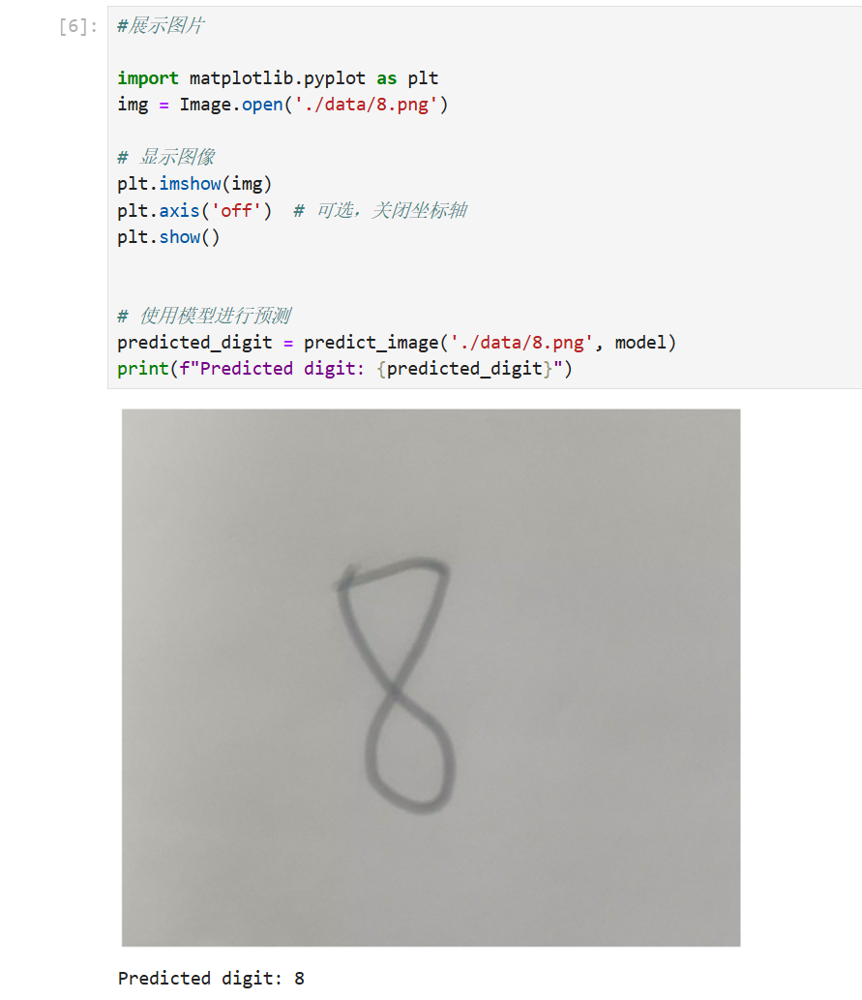

# 🚀 PyTorch 深度学习实战教程 🚀

欢迎来到 **PyTorch 深度学习实战教程**！🎉  

本项目汇集了多个基于 PyTorch 的深度学习实战项目，注释详尽、结构清晰，非常适合作为学习和练习 PyTorch 的参考项目。

**不断完善ing...**

## 🎯更新日志
- 2024-11-23: 新增项目1: 手写体数字识别
- 2024-12-02: 新增项目2: 猫狗图像分类

---

## 目录 📚

1. [手写体数字识别 (Handwritten Digit Recognition)](#1-手写体数字识别-handwritten-digit-recognition)  
2. [猫狗图像分类 (Cat & Dog Image Classification)](#2-猫狗图像分类-cat--dog-image-classification)

---

## 🧐 项目介绍

- 包含多个经典 PyTorch 项目：手写体数字识别、猫狗分类等。
- 每个项目配备完整的代码流程，包括数据处理、模型训练、结果可视化、模型保存及推理调用等。
- 项目中的一些细节优化均有详细的注释, 但是并不保证完整正确或者真的能提升性能。读者可以加以分析参考, 提出自己的见解, 有什么想法欢迎提出issues进行交流。
- 项目中的readme会记录有模型迭代的过程还有作者当时的一些想法, 一定不要错过
- **项目会持续更新和优化，欢迎关注！**🌟

如果觉得这个项目有帮助, 别忘了点个star支持一下! ⭐, 并留下宝贵的意见。 
如果有任何问题，欢迎提 Issues, 作者在看到后会及时回复。💬

### 项目结构 📂

PyTorch
- datasets 数据集
- models 模型权重
- 1_Handwritten_Digit_Recognition
- 2_Cat_Dog_Image_Classification
- readme.md

⚠️ **提示**
- 有些模型效果可能不太好。 你可以自行探索，修改模型结构和一些参数以达到更好的效果，还可以在项目代码基础上扩展更丰富的功能。当然最重要是还是要熟悉整个流程。
- 为了达到更好的训练效果, 作者在编写代码训练模型时在不断尝试不同的方法, 但是这个过程在代码中可能并没有体现。 希望大家能够自己多修改一些参数, 使用不同的模型结构和方法, 去感受模型训练的过程
- 在 2 之后的项目, 作者会尽可能详细地记录下每次训练迭代的过程, 用不同的方式会得到什么样的训练结果，以供大家分析参考。

---

## 环境要求 ⚙️

- Python 3.x
- PyTorch 深度学习框架
- Jupyter Notebook 用于交互式编程
- 其他依赖库

---

## 1. 手写体数字识别 (Handwritten Digit Recognition)

🖊️🔢

### 🎯 项目概述
本项目基于经典的 MNIST 数据集，训练一个简单的卷积神经网络, 逐步实现从单个数字到多个数字的手写体识别

### 项目展示

### 项目结构 📂
- **train**: 数据集下载与处理，模型训练、评估及结果可视化，保存训练好的模型。
- **digit_recognition**: 加载本地保存的模型，对本地手写体数字图片进行单个数字的预测。
- **digit_recognition_multi**: 在 `digit_recognition` 的基础上扩展，对包含多个数字的图片，使用 `opencv` 分割图片后逐一识别并合并结果（效果可能较弱，可以尝试进行优化）。
- **data**: 用于给训练好的模型推理的图片

最后多数字识别的效果有点差，可能是因为分割数字的算法效果不好, 或者是对图像的处理不满足训练数据的匹配特征，或者别的什么原因？

### 💡 一些想法

- 分割的算法很关键，会直接影响到模型预测结果。如果有一个好的分割算法，用一个识别单个字符的模型就可以实现识别一组字符的功能。
- 现在已经能够识别多个数字，如果自己能够找一些手写运算符号的数据集（+ - × ÷...）一起训练模型，就能让模型识别基本的算术表达式。自己再写函数对表达式进行处理计算结果，就得到了数学计算题目-->运算结果的高级模型😁！
- 如果能够找到字母数据集进行训练, 就可以得到一个简单的OCR模型(汉字数据集太大了，就不考虑了哈哈)
- 如果找不到优质的公开数据集，可以自己在一张纸上写一堆字符，然后用视觉算法分割开，再进行不同的数据增强操作，可以快速得到大量数据集。
- 这个项目可以不断进行优化迭代, 希望大家能多多尝试！

---

## 2. 猫狗图像分类 (Cat & Dog Image Classification) 

🐱🐶

### 🎯 项目概述

本项目基于 [Kaggle 猫狗数据集](https://www.microsoft.com/en-us/download/details.aspx?id=54765) ，使用 PyTorch 构建并训练一个卷积神经网络，用于分类猫和狗的图像。

### 项目展示

### 项目结构 📂
- **dataset_process**: 对数据集进行处理，划分为训练集和测试集(通用代码，可以迁移到其他的图片数据集)。
- **train**: 因为训练时间可能比较久，加上了进度条显示，可以直观感受到模型的训练进度。
- **cat_dog_classification**: 加载本地保存的模型，对本地猫狗图片进行分类预测。
- **data**: 包含本地上传用于预测的猫狗图片，以及不同参数下模型训练的结果。

### 项目亮点 ✨
- 相比于手写体数字识别的项目, 本项目构建了相对复杂的CNN模型
- 项目readme中记录了不同的训练设置所对应的训练结果, 并且探讨了数据集标准化对训练结果的影响

### 待探究的问题 🔬
- 当增加数据增强操作后, 明明数据集大小和数量都没变, 但是不知道为什么训练速度很明显变慢了(一个epoch平均不到5min->10min)。&cross;
- 使用基于当前数据集的统计值的数据标准化操作能不能达到更好的效果？ &cross;

---

## ✨ 更多项目待续...

Happy Coding! 😄